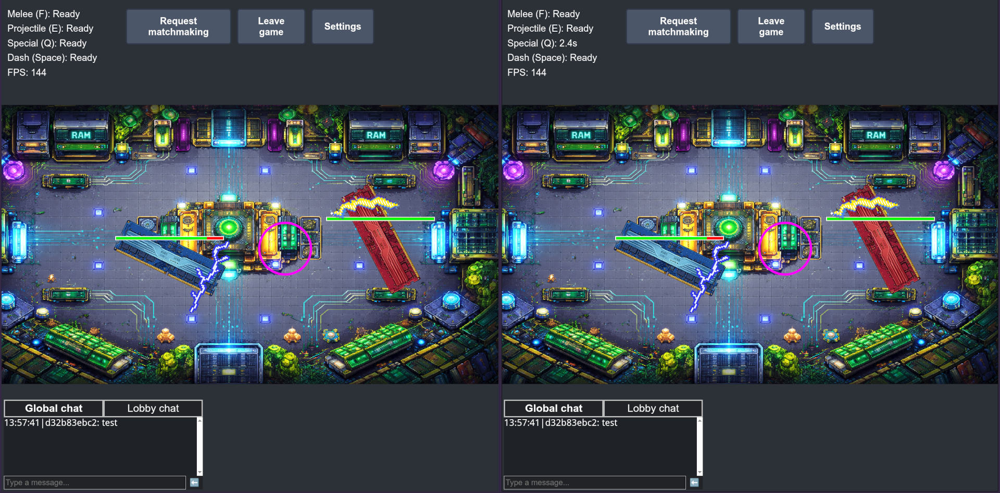

# RAMpocalypse

Online 2-player battle arena.



|              |                                                                                                         |
| ------------ | ------------------------------------------------------------------------------------------------------- |
| **Frontend** | [RAMpocalypse-Frontend](https://github.com/p-barski/RAMpocalypse-Frontend) — Vite, React, TypeScript    |
| **Backend**  | [RAMpocalypse-Backend](https://github.com/p-barski/RAMpocalypse-Backend) — ASP.NET 10, SignalR, MongoDB |
| **Live**     | https://rampocalypse-ajesd7evfrh5acad.polandcentral-01.azurewebsites.net/                               |

Github workflow builds the frontend, copies it into `wwwroot/app`, and publishes whole app to Azure.

### Backend

```bash
cd src/RAMpocalypse.Server
dotnet run
```

API: http://localhost:5027 — SignalR hub: `/gamehub`

MongoDB is optional. Without a connection string the server uses an in-memory stub (`DummyDb`). MongoDB settings:

as env vars:

```
MongoDB__ConnectionString="<your-connection-string>"
MongoDB__DatabaseName="rampocalypse"
```

as user-secrets:

```bash
dotnet user-secrets set "MongoDB:ConnectionString" "<your-connection-string>"
dotnet user-secrets set "MongoDB:DatabaseName" "rampocalypse"
```

### Frontend

Env vars:

```
VITE_SERVER_URL=http://localhost:5027
```

```bash
npm run dev
```

App: http://localhost:5173
